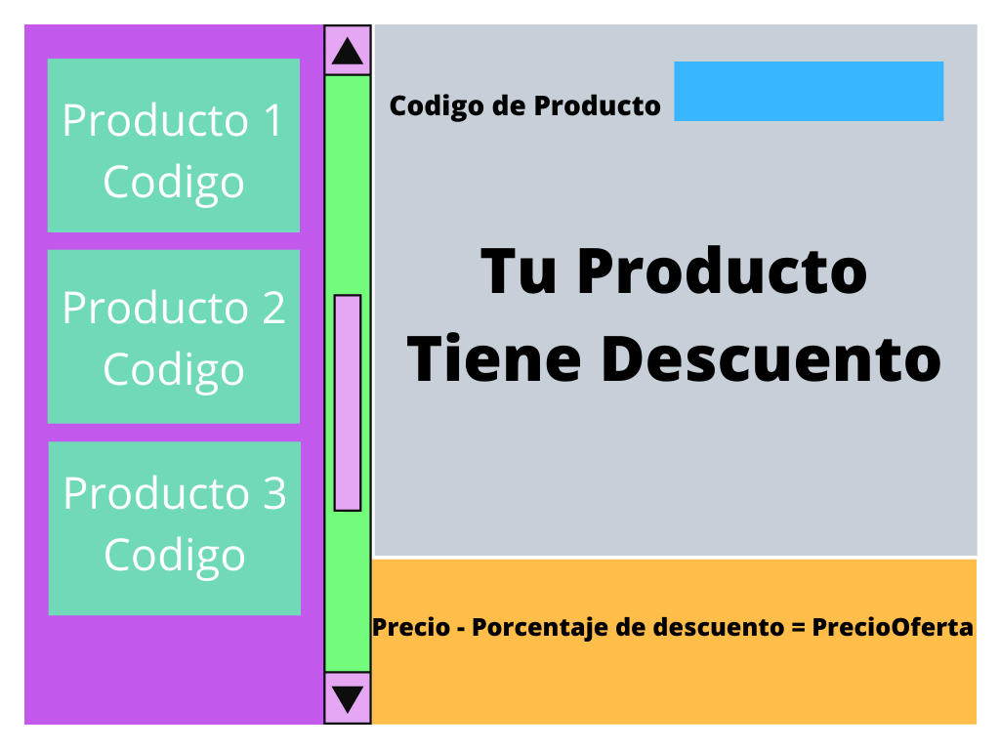

# Test A 


## Serie I (20 pts)

1. ¿Qué es una variable y para qué sirve?
2. ¿Cuál es la diferencia entre declarar e inicializar una variable?
3. ¿Cuál es la diferencia entre sumar números y concatenar strings?
4. ¿Qué es una función?
5. ¿Cuándo me sirve usar una función en mi código?
6. ¿Cuál es la diferencia entre parámetros y argumentos de una función?
7. ¿Qué es una condicional?
8. ¿Qué es un ciclo?
9. ¿Qué es un array?
10. ¿Qué es un objeto?


## Serie II (20 pts)

1. Convierte el siguiente código en una función la cual me permita hacer una operación a la vez, permitiendo ingresar los dos números a operar.

``` 
let number = 10
let number2 = 20

let sum =  number + number2
let subtraction = number2 - number
let multiplication = number * number2

console.log(`sum: ${sum}, result subtraction: ${subtraction }, multiplication: ${multiplication}`)
```
2. Crea una función que pueda recibir cualquier array como parámetro e imprima todos sus elementos uno por uno (no se vale imprimir el array completo).


## Serie III (30 pts)

1. Crea una clase llamada Producto con las siguientes propiedades.

    - Nombre
    - Precio
    - TieneDescuento
    - PorcentajeDescuento
    - Cantidad
    - Codigo

2. Crea 6 Productos a partir de la clase que acabas de crear en el paso 1.
3. Crea una interfaz similar a la siguiente:

4. Agrega las funciones correspondientes para: 
    - Buscar un producto por Codigo
    - Al encontrar el producto debes mostrar si el producto tiene descuento o no. 
    - Si el producto tiene descuento Debes mostrar y hacer la operación en la parte de abajo, para que el usuario sepa cuanto es el precio que pagaría despues del descuento.


## Serie IV (30 Pts)

1. Dado el siguiente Endpoint. 
    - http://api.magicthegathering.io/v1/cards
    Documentación: https://docs.magicthegathering.io/#api_v1cards_list
2. Se solicita que cree una interfaz donde se pueda visualizar la imagen de la carta, la descripción y el texto, tome en cuenta que se necesita que se presenten cartas por fila. 

