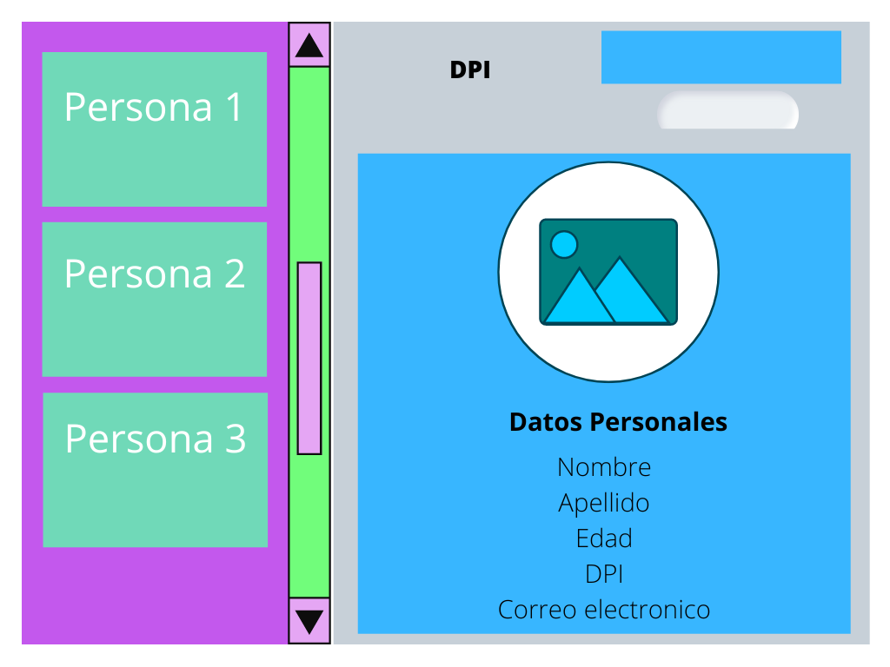

# Test A 


## Serie I (20 pts)

1. ¿Puedo mezclar arrays con objetos o incluso objetos con arrays? 
2.  ¿Qué es un objeto? 
3. ¿Cuál es la diferencia entre sumar números y concatenar strings?
4. ¿Qué es una función?
5. ¿Cuándo me sirve usar una función en mi código?
6. ¿Cuál es la diferencia entre parámetros y argumentos de una función?
7. ¿Qué es un array?
8. ¿Cuál es la diferencia entre declarar e inicializar una variable?
9. ¿Cuándo es mejor usar objetos o arrays?
10. ¿Qué es una variable y para qué sirve?


## Serie II (20 pts)

1. Convierte el siguiente código en una función la cual me permita generar el mismo saludo con diferentes nombres y apellidos.

``` 
let nombre = "MangoChango"
let apellido = "Academy"

console.log(`Su primero nombre es ${nombre} y su primer apellido es ${apellido}`)

```

2. Crea una función que pueda recibir cualquier array como parámetro e imprima su primer elemento.


## Serie III (30 pts)

1. Identifica el tipo de dato para almacenar en variables la siguiente información:

    - Nombre
    - Apellido
    - Edad
    - Correo electrónico
    - Esta Casado
    - Cantidad de Hijos
    - Total de Dinero
    - Foto
    - dpi

2. Crea una clase llamada *persona* con los datos anteriores.
3. Crea 10 objetos a partir de la clase creada en el paso 2.
4. Cree una interfaz similar a la siguiente:

5. Agrega las funciones correspondientes para: 
    - 5.1  Buscar a una persona por dpi. 
    - 5.2 Si la persona es encontrada deberá mostrar todos los datos de la persona así como su Foto.    


## Serie IV (30 Pts)

1. Dado el siguiente Endpoint. 
    - https://pokeapi.co/api/v2/pokemon/{name}
    Documentación: https://pokeapi.co/docs/v2
2. Se solicita que cree una interfaz donde se pueda ingresar el nombre de un "Pokemon" a través de un input y permita buscar ese "Pokemon", deberá mostrar la imágen del "Pokemon", el nombre, las habilidades y su próxima evolución. 

